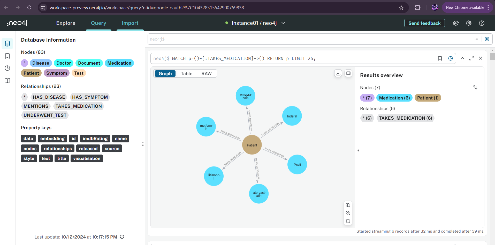

## GraphXplorer: AI-powered Graph RAG
GraphXplorer is a Realtime Graph-RAG (Graph-based Retrieval Augmented Generation) application that allows users to upload PDF documents, extract their content into a Neo4j graph database, and perform complex natural language queries on the extracted knowledge graph. Powered by LangChain and OpenAI's GPT models, it translates natural language questions into Cypher queries, delivering structured insights in real-time.

## Demo App

## Features
PDF Upload and Parsing: Upload PDF documents to extract and visualize information in a graph structure.
Graph-based Data Representation: Utilizes Neo4j for structuring document information into nodes and relationships, creating an interactive knowledge graph.
Natural Language Querying: Ask questions about the data, and the app dynamically generates and executes Cypher queries to return relevant answers.
OpenAI Integration: Leverages GPT-4 models for query generation and LangChain for graph processing.
Embeddings and Vector Search: Create embedding vectors for node search using OpenAI embeddings and Neo4j vector search capabilities.

## Technologies Used
LangChain: Framework for language models and document processing.
OpenAI GPT: Natural language processing model for generating Cypher queries.
Neo4j: Graph database for representing documents as connected nodes and relationships.
Streamlit: Web interface for uploading files and interacting with the graph.

## Set up Environment Variables
Create a .env file in the project directory and add your OpenAI API Key and Neo4j credentials:

OPENAI_API_KEY=your_openai_api_key
NEO4J_URL=your_neo4j_url
NEO4J_USERNAME=neo4j
NEO4J_PASSWORD=your_neo4j_password

Run the App: Streamlit run main.py

## How to Use
Connect to Neo4j: Enter your Neo4j credentials to connect the app to your graph database.
Upload PDF: Select and upload a PDF file. The file will be processed, and its content will be structured into a graph database.
Ask Questions: Use the input field to ask questions about the data in natural language. The app will generate Cypher queries and provide relevant responses.

## Contributors
Ahmad A Shaik, Ph.D.
License
This project is licensed under the MIT License.
